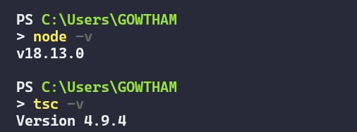

# TypeScript

TypeScript is a programming language that extends JavaScript with static type checking. It is a strict superset of JavaScript, meaning it can be used with all the features of JavaScript but also provides additional features such as type annotations, interfaces, and custom types. TypeScript behaves like a compiled language, allowing developers to catch errors before runtime and providing instant feedback in the IDE. TypeScript can also be transpiled into different versions of JavaScript to support older environments. The main goal of TypeScript is to enable static typing and improve code quality.

It is important to understand that it is a superset of JavaScript, not a replacement for it. TypeScript allows developers to write JavaScript in a more precise manner, which can help catch errors before they occur at runtime, many popular JavaScript libraries and frameworks are now supporting TypeScript, making it a more viable option for large-scale projects.

Dependecies:

 inistall nodeJS (LTS) from here - https://nodejs.org/en/download/

 check node installed properly by running in terminal

    node -v 

 Then enter following line in cmd to install TypeScript globally in the local machine

    npm install  -g typescript

 To check TypeScript installed properlly enter following line in terminal

    tsc -v

# Hello World Program
check the code in the hello_world directory
compile the index.ts file by opening terminal in the file location then enter

    tcs index.ts 

now the TS code compiled and the index.js file will be created inside the hello_world directory.

Ref:

    https://rlee.dev/series/practical-guide-to-fp-ts
    https://www.w3schools.com/typescript/index.php
    https://www.youtube.com/watch?v=d56mG7DezGs
    https://www.youtube.com/watch?v=gp5H0Vw39yw